# Loop

Real-time geo-matching platform connecting cargo owners with vehicle drivers in Rwanda. Monorepo:

```
loop/
├── mobile/   Flutter app (cargo owner + driver)    → see mobile/README.md
├── api/      NestJS REST API + PostgreSQL/PostGIS   → see api/README.md
├── admin/    Next.js admin (verification + metrics) → see admin/README.md
└── docs/     engineering spec (BUILD_SPEC.md)
```

The **API is the system of record** (PostgreSQL/PostGIS). The mobile app and admin are clients of it.

## Contents

- [Try it](#try-it)
- [Install the Android app (Android APK)](#install-the-android-app-android-apk)
- [Quick start (local development)](#quick-start-local-development)
- [Deployment](#deployment)
- [Walkthrough video](#walkthrough-video)
- [Screenshots](#screenshots)
- [Testing](#testing)
- [Status](#status)
- [Technical report](#technical-report)
- [Roadmap (Future Works)](#roadmap-future-works)
- [Contributing](#contributing)
- [License](#license)

## Try it

| | Link |
| --- | --- |
| **Admin (web)** | <https://loop-admin-prod.up.railway.app> — sign in with the demo admin `admin@loop.rw` / `Admin@2026`, a throwaway account seeded for evaluation since there is no public admin signup at the moment. |
| **API** | <https://loop-api-prod.up.railway.app> · Swagger at [`/docs`](https://loop-api-prod.up.railway.app/docs) |
| **Mobile app (Android APK)** | Download and install — see [Install the Android app](#install-the-android-app-android-apk) below. Or build/run the Flutter app against the deployed API. |
| **Demo video** | <https://youtu.be/iMEG5E_Awnc> |

The mobile app runs against the deployed API with no local backend:

```bash
cd mobile && flutter pub get
flutter run --dart-define=API_BASE_URL=https://loop-api-prod.up.railway.app
```

An Android emulator (with Google Play services, for push) or a physical device works — see [mobile/README.md](mobile/README.md#android-emulator).

## Install the Android app (Android APK)

The release APK is already configured to talk to the hosted API — no local backend or setup is needed. It targets **Android** (Android 6.0 / API 23 and newer).

1. **Download** the APK to your Android phone from the latest release:
   **[Loop release APK](https://github.com/josueahadi/loop/releases/latest)** → download the `loop-v1.0.0.apk` asset. Or scan this QR code with the phone's camera:

   

   (If you download it on a computer, transfer the file to the phone.)
2. **Allow install from this source.** Open the downloaded file. Android will ask to permit installs from your browser or file manager: tap **Settings → allow from this source** (the standard prompt for any app installed outside the Play Store), then go back and continue.
3. **Install.** If a **"App blocked"** or **"Unsafe app blocked"** message appears (Play Protect scanning an app it doesn't recognise), do **not** tap *OK* or *Got it* — that cancels the install. Instead tap **More details** (or the small expander), then **Install anyway**. Open **Loop**.
4. **Grant permissions when asked** — location (so nearby matching works) and notifications (for job/proposal push).
5. **Create an account** in the app (pick **Cargo owner** or **Driver**), or sign in. Everything runs against the live hosted backend.

> To try the full owner ↔ driver loop on one phone, register one account, sign out, and register the other role — or use two devices. The admin side (verification approval, metrics) is the web console linked in [Try it](#try-it).

> **⚠️ Gotcha — if the app times out on mobile data:** on some Rwandan mobile networks (observed on MTN) the app can time out at login/registration while working fine on Wi-Fi. This is **not an app bug** — it is a routing problem between the mobile carrier and the host's (Railway's) edge IP, a [documented Railway pattern](https://station.railway.com/questions/why-server-not-reachable-with-mobile-net-b1c32b80) that Railway staff attribute to the carrier's network, not the app. **Workaround:** use Wi-Fi or a different carrier. **Durable fix:** front the API with a Cloudflare-proxied custom domain — the plan and diagnosis are in [DEPLOYMENT.md section 12](DEPLOYMENT.md#12-cdn--custom-domain-network-reachability). It was found on 10 July 2026, late in testing, because emulators, the dev network, and Wi-Fi all reach the API normally.

To build the APK yourself instead, see [DEPLOYMENT.md section 6 (Mobile APK)](DEPLOYMENT.md#6-mobile-apk).

## Quick start (local development)

**Prerequisites:** Docker, Node.js 20+, and the Flutter SDK.

```bash
# 1. Database — PostgreSQL 17 + PostGIS 3.5 (host port 5433)
docker compose up -d

# 2. API — NestJS on http://localhost:3000 (Swagger at /docs)
cd api
cp .env.example .env            # dev defaults: stub mail/storage/push
npm install
npm run migration:run           # creates the schema + PostGIS extension
npm run seed                     # seeds the admin account + pricing/size config
npm run start:dev

# 3. Admin — Next.js on http://localhost:3001
cd ../admin
cp .env.example .env.local       # NEXT_PUBLIC_API_BASE_URL=http://localhost:3000
npm install
PORT=3001 npm run dev            # http://localhost:3001  (login: admin@loop.rw)

# 4. Mobile — Flutter (iOS simulator / Android emulator / device)
cd ../mobile
flutter pub get
flutter run --dart-define=API_BASE_URL=http://localhost:3000
#   Android emulator: use http://10.0.2.2:3000 instead of localhost
#   Deployed API (no local backend): use https://loop-api-prod.up.railway.app
```

To run the mobile app against the **deployed** backend, just point `API_BASE_URL` at the hosted API — see [`mobile/README.md`](mobile/README.md#run) and, for the release APK, [DEPLOYMENT.md section 6 (Mobile APK)](DEPLOYMENT.md#6-mobile-apk).

The seeded admin credentials come from `ADMIN_EMAIL` / `ADMIN_PASSWORD` in `api/.env` (defaults: `admin@loop.rw` / `change-me-admin`). The seed also provisions a fixed **demo admin** — `admin@loop.rw` / `Admin@2026` — so the deployed admin console can be signed into for evaluation without a public admin signup (`DEMO_ADMIN_EMAIL` / `DEMO_ADMIN_PASSWORD` override it). It is a throwaway evaluation login and will be archived (rotated or removed) once the defence is complete. Backend details and the full endpoint list are in [`api/README.md`](api/README.md); the admin app is documented in [`admin/README.md`](admin/README.md).

## Deployment

Loop deploys to **Railway** as one project with three services (PostGIS DB, API, admin) plus external Firebase Storage/FCM and SendGrid. Full, reproducible steps — architecture, environment matrix, prerequisites, deploy commands, going-live, the mobile APK build, secrets handling, and a hosted-stack verification checklist — are in **[DEPLOYMENT.md](DEPLOYMENT.md)**.

## Walkthrough video

📹 **[Watch the walkthrough (5 min)](https://youtu.be/iMEG5E_Awnc)** — the core loop end to end: driver verification, posting a job with a cost estimate, nearby matching, sending and accepting a proposal, in-app messaging, completing and rating, and the admin metrics dashboard.

## Screenshots

The core flow, captured across both mobile apps and the admin console. More views (welcome, permissions) are in [`screenshots/`](screenshots/).

| | |
| --- | --- |
| **Driver verification upload** | **Admin verification queue** |
| 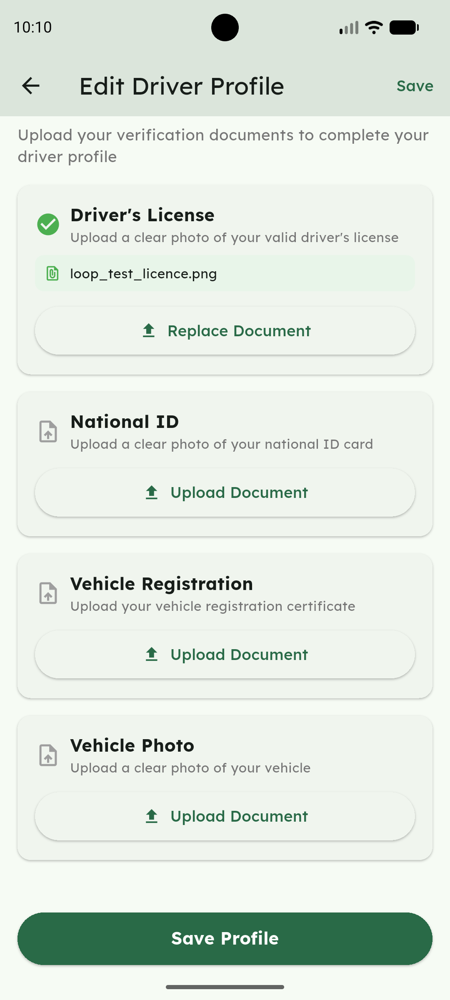 | 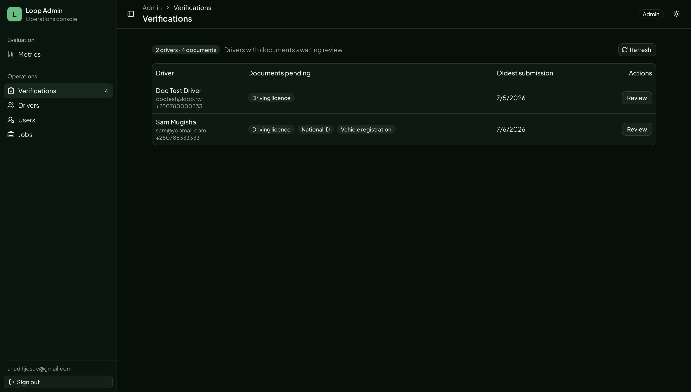 |
| **Admin document review** | **Reject with a reason** |
| 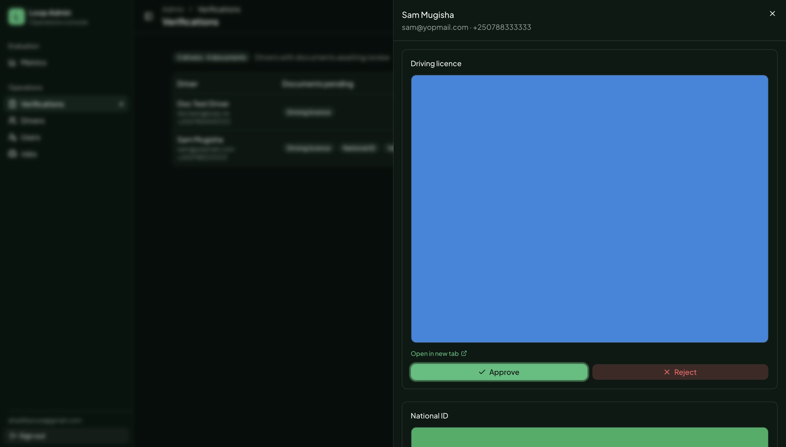 | 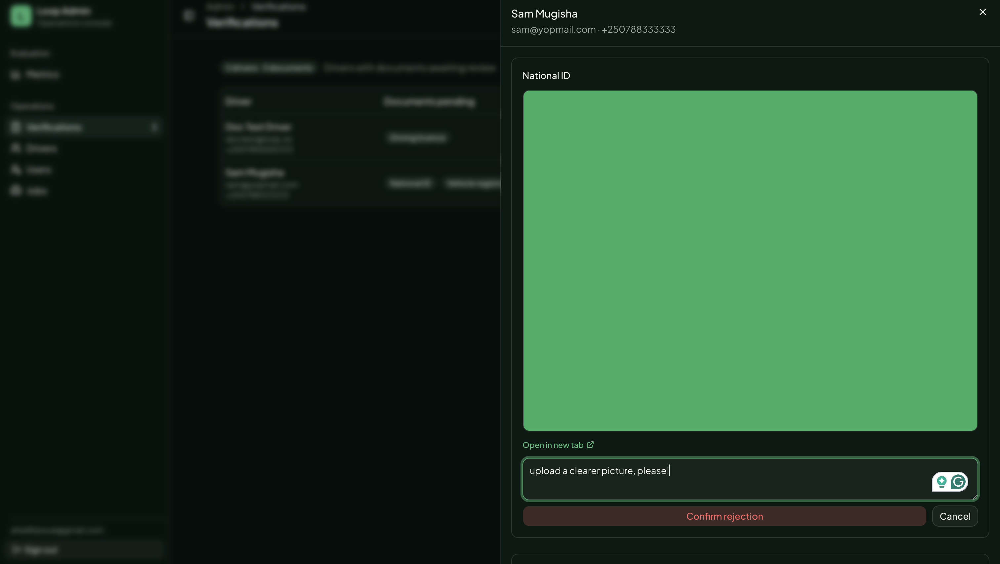 |
| **Driver online** | **Owner creates a job** |
| 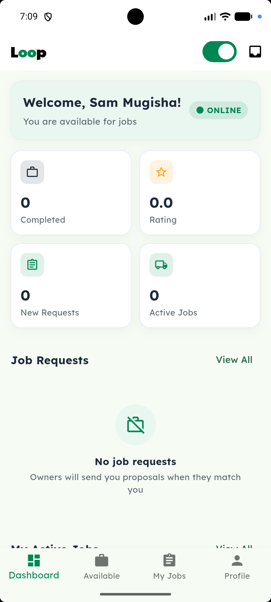 | 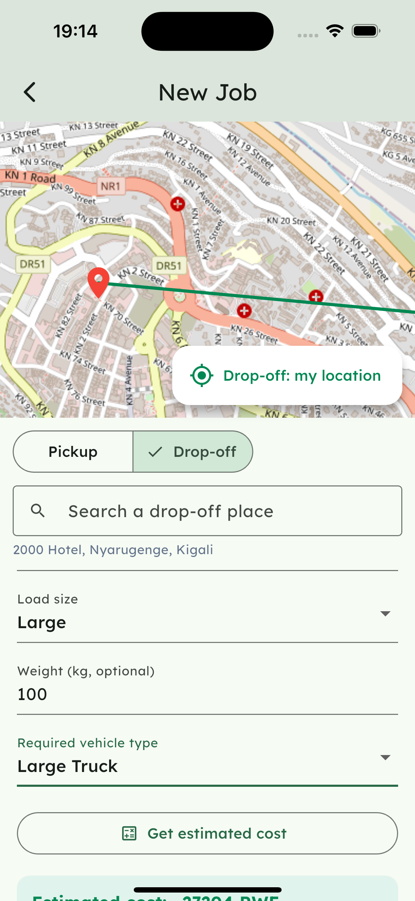 |
| **Cost estimate** | **Nearby drivers** |
| 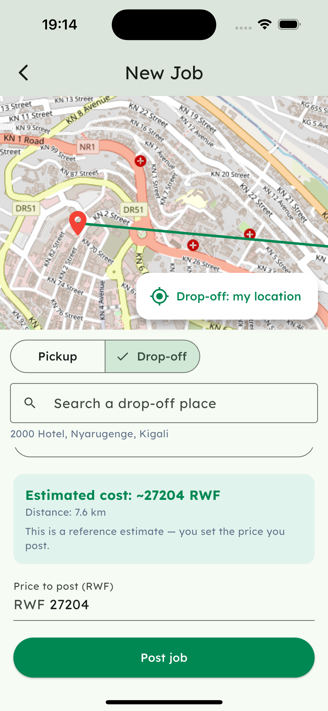 | 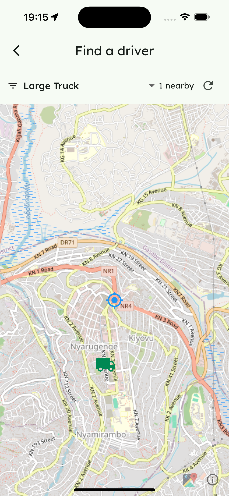 |
| **Send proposal** | **Driver job request** |
| 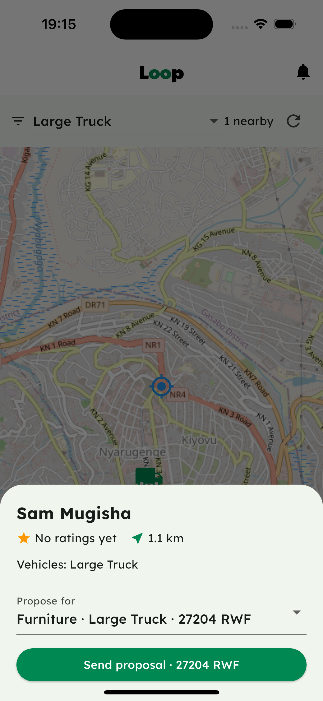 | 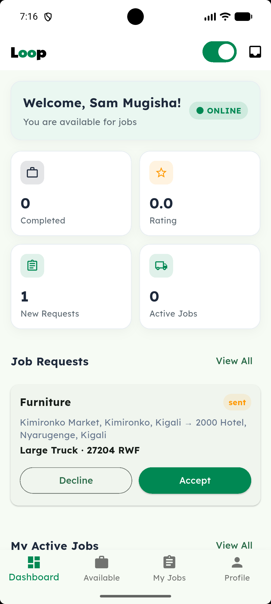 |
| **In-app chat** | **Driver sees a rejected document** |
| 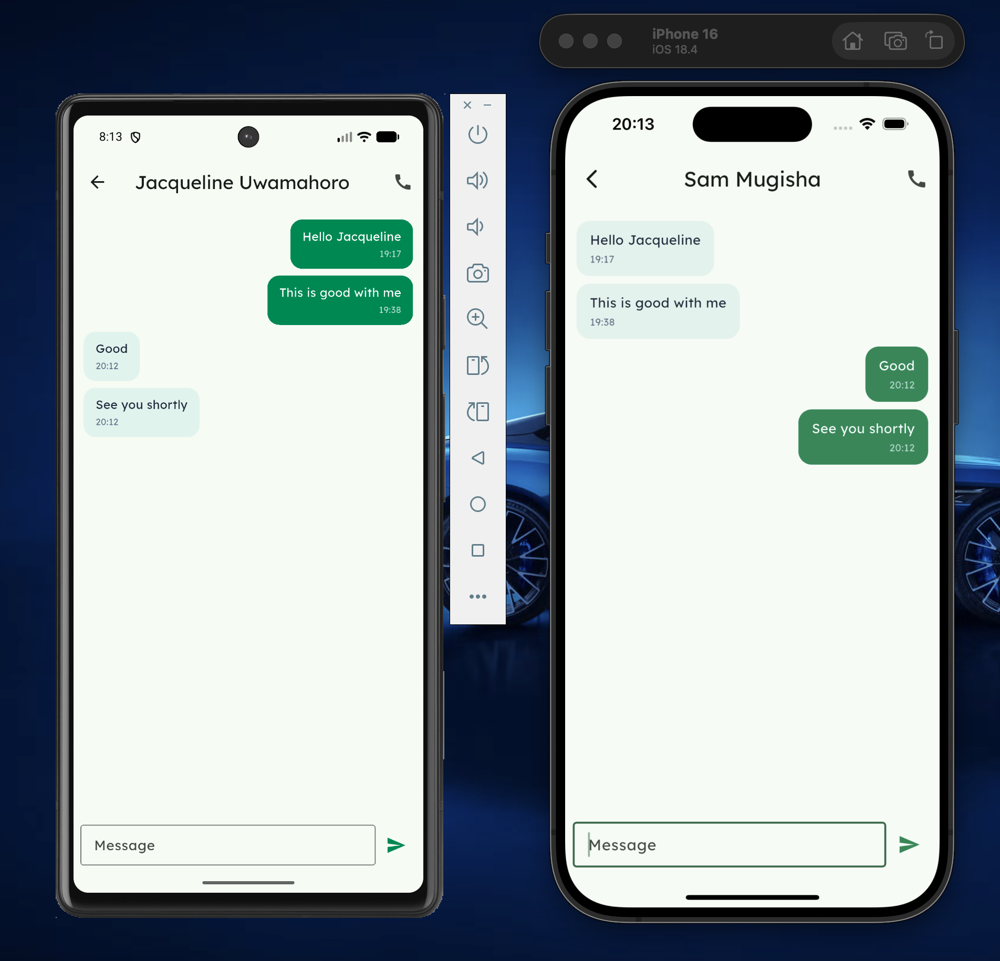 | 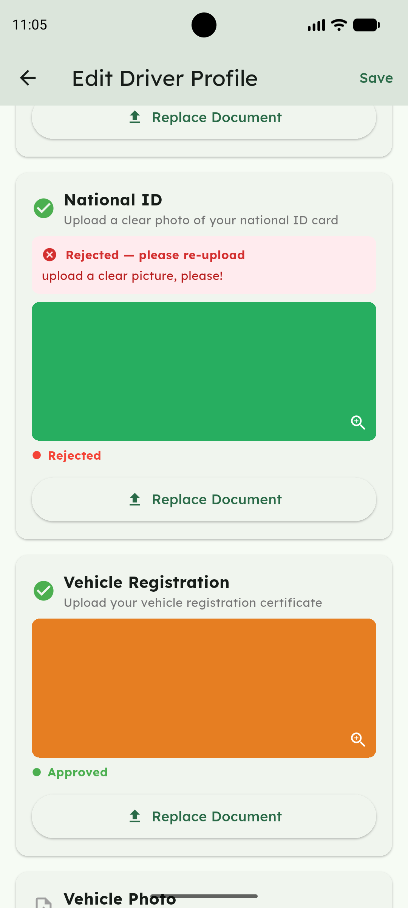 |
| **Rate the driver** | **Admin metrics dashboard** |
| 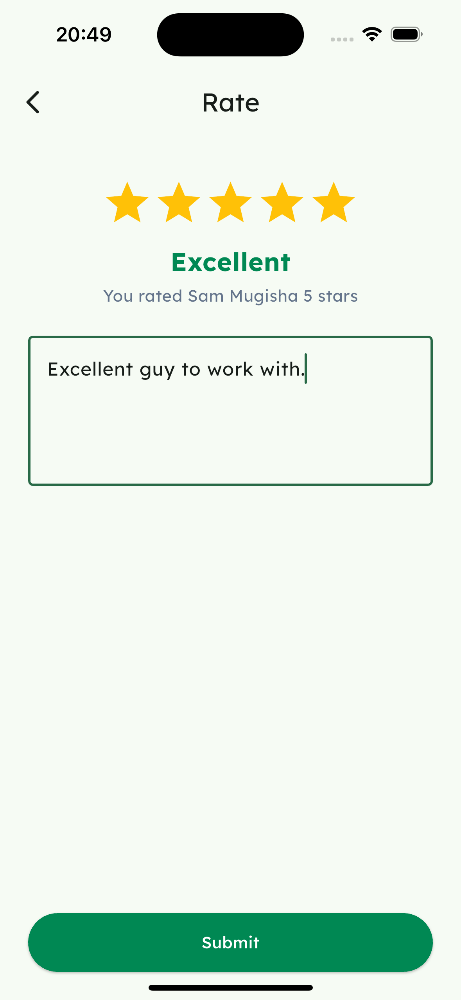 | 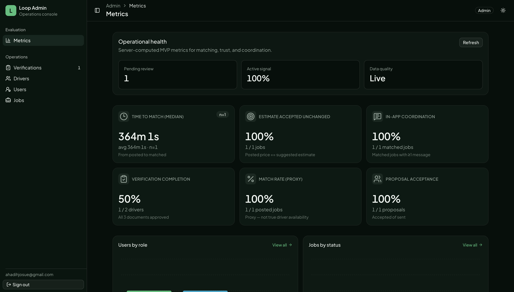 |
| **Driver's ratings (reputation)** | |
| 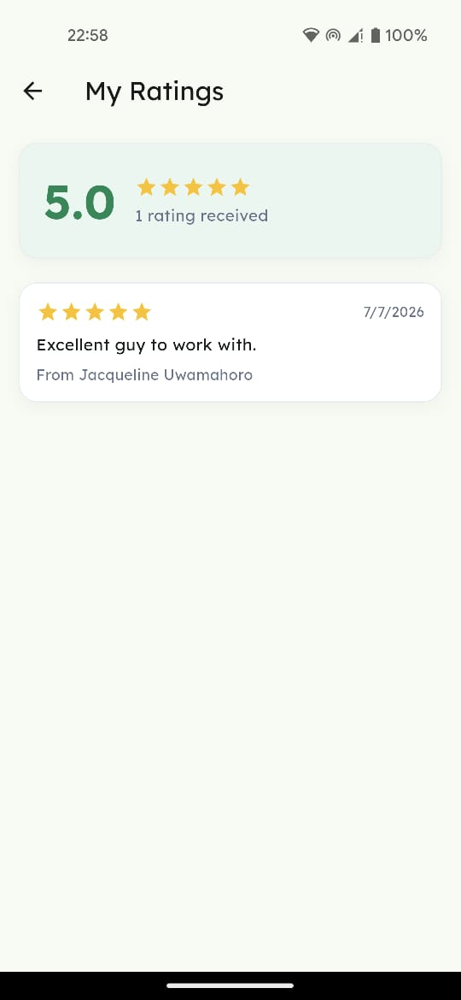 | |

## Testing

Each package has an automated suite (API — Jest; admin — Vitest; mobile — Flutter), plus a manual end-to-end matrix and a post-deploy verification checklist. How to run each, the strategies, and the device/environment constraints are in **[TESTING.md](TESTING.md)**.

```bash
cd api && npm test        # pricing formula, proposal state machine, auth
cd admin && npm test      # pagination + metrics formatters
cd mobile && flutter test # model / screen / widget tests
```

## Status

All milestones **M1–M6** are built (the milestone plan is [section 6 of `docs/BUILD_SPEC.md`](docs/BUILD_SPEC.md#6-suggested-build-order-maps-to-the-junaug-timeline)):

- **M1 — Foundation:** monorepo, database schema for all core entities, NestJS-issued JWT auth (argon2, access + rotating refresh), driver verification + admin review.
- **M2 — Matching:** availability + location capture, PostGIS nearby-driver query (approved **and** online, nearest first), `flutter_map`/OpenStreetMap map view + vehicle-type filter, vehicle CRUD.
- **M3 — Pricing + jobs:** rule-based **cost-estimate** endpoint + editable config, pin-based job creation and posting (both the estimated cost and the owner-set price are persisted).
- **M3.5 — Location:** OpenStreetMap place/landmark search + reverse-geocoding + "Open in Maps" navigation hand-off.
- **M4 — Transaction loop:** proposals (accept/decline), in-app messaging (REST + WebSocket), `tel:` call button, FCM push (stub-safe).
- **M5 — Trust:** two-way ratings + portable reputation.
- **M6 — Admin:** Next.js verification queue + server-computed metrics dashboard + read-only drivers/users/jobs directory.

## Technical report

The full write-up (how each proposal objective was met, a requirements-to-code traceability table, the analysis of results, discussion of the milestones, and future work notes) is in **[docs/TECHNICAL_REPORT.md](docs/TECHNICAL_REPORT.md)**.

## Roadmap (Future Works)

Loop currently runs as a single **Railway** project (PostGIS DB + API + admin), chosen for pilot simplicity. The architecture is deliberately portable — Dockerised services, a standard `DATABASE_URL`, and an env-driven `DB_SSL` flag — so the planned production moves below are each a **configuration change, not a rewrite**:

- **Database → managed Postgres + PostGIS (Supabase):** automated backups + point-in-time recovery and a management dashboard, versus the pilot's self-managed container.
- **Admin → Vercel:** Next.js-native hosting with per-branch preview deployments.
- **API → Fly.io (Johannesburg region):** lower latency to users in Rwanda than EU-region hosting.

A product-side item is **admin user management**: today the single admin is seeded (no public admin signup, by design), and a later phase adds a super-admin who can create and manage other admin accounts from the admin console.

See **[DEPLOYMENT.md section 11 (Future / production migration)](DEPLOYMENT.md#11-future--production-migration)** for the infrastructure detail. Other product/feature future work (payments, live driver tracking, an abstracted basemap, road routing) is tracked in [`docs/BUILD_SPEC.md`](docs/BUILD_SPEC.md).

## Contributing

`main` is protected and always deployable, so work happens on short-lived branches and lands through a pull request.

1. **Branch** from `main`: `feat/<area>-<desc>`, `fix/<desc>`, or `chore/<desc>` (e.g. `feat/api-road-distance`).
2. **Commit** in the conventional style — `feat(api): …`, `fix(mobile): …`, `docs: …`. Keep messages clean, with no AI-attribution or co-author trailers.
3. **Test** the package you touched before opening the PR:
   ```bash
   cd api && npm test          # NestJS (Jest)
   cd admin && npm test        # Next.js (Vitest)
   cd mobile && flutter test   # Flutter
   ```
   Per-package setup is in each package's README; conventions live in [`docs/BUILD_SPEC.md` section 9](docs/BUILD_SPEC.md#9-project-structure--conventions-dry-feature-based).
4. **Open a pull request** against `main`. A review is required before merge; keep the change scoped to the MVP feature set (check it against "What we are building" and "Out of scope" in the docs).

Secrets never go in git — commit `.env.example`, never a real `.env` or a service-account key.

## License

Proprietary — © 2026 Habib Josue Ahadi, all rights reserved. The source is
available in this repository for reference and academic evaluation only; it may
not be copied, modified, redistributed, or used without prior written
permission. See [LICENSE](LICENSE). Third-party dependencies remain under their
own licenses.
