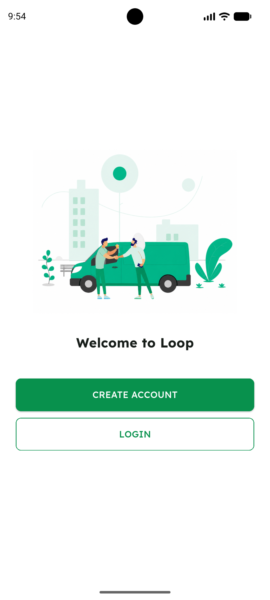
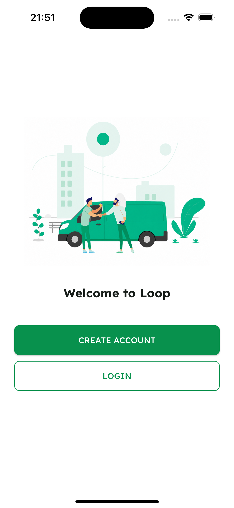
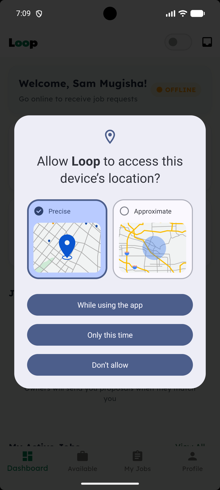
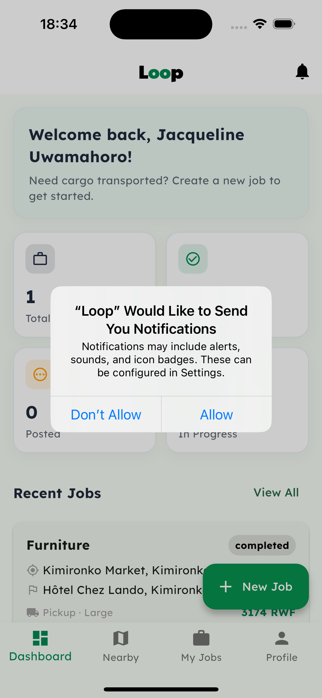

# Screenshots

App captures of the core flows, referenced from the root [README](../README.md).

**Naming:** the numbered core-loop captures follow `NN-surface-role-subject.png`,
where `NN` is a two-digit order number, the surface is `mobile` or `admin`, the
role is `owner` / `driver` / `admin` / `both`, and the subject is a short
kebab-case phrase (e.g. `06-mobile-owner-cost-estimate.png`). Platform-specific onboarding and
permission captures are prefixed by platform instead (`android-…`, `iphone-…`).

## Core loop

### 1. Driver verification upload
A driver uploads their licence, national ID, and vehicle registration — mandatory before they can work.

### 2. Admin — verification queue
The internal admin console lists drivers awaiting review, grouped by driver.

### 3. Admin — document review
An admin opens a submitted document to approve it.

Rejecting a document with a reason, which the driver then sees.

### 4. Driver online
Once verified, the driver goes online and becomes available for matching.

### 5. Owner — create job
A cargo owner sets pickup and drop-off on the map and describes the load.

### 6. Owner — cost estimate
The system shows an estimated cost and distance; the owner sets the final price.

### 7. Owner — nearby drivers
Available, verified drivers nearby, ordered by proximity and filtered by vehicle type.

### 8. Owner — send proposal
The owner selects a driver and sends a proposal at the posted price.

### 9. Driver — job request
The driver receives the proposal and can accept or decline.

### 10. Messaging
In-app chat opens between owner and driver once the proposal is accepted.

## Onboarding & permissions

### Welcome
The welcome screen on Android.

The welcome screen on iPhone.

### Permission prompts
The location permission request on Android.

The notifications permission request on iPhone.

